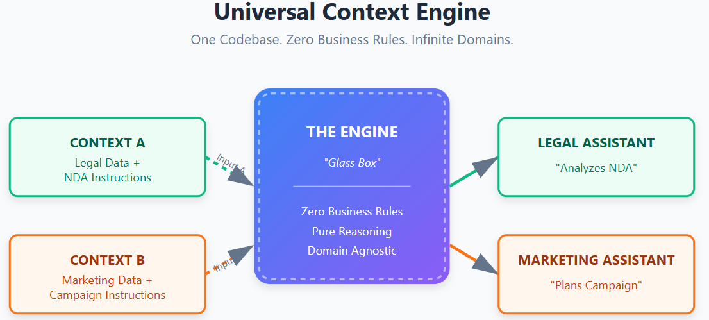
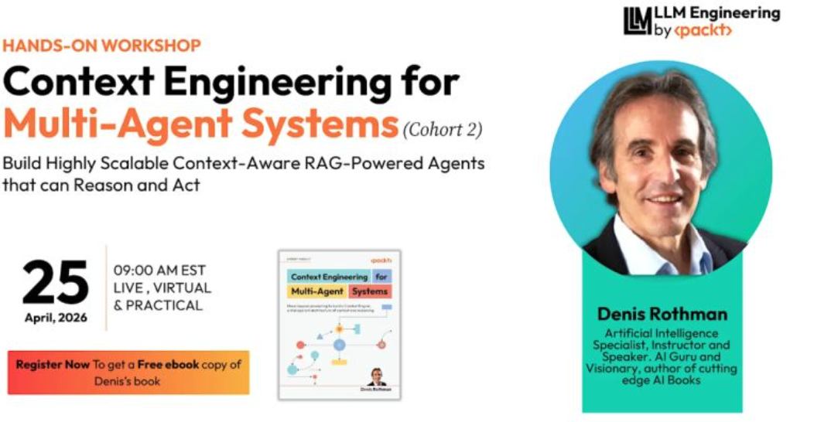

# Context Engineering for Multi-Agent Systems

<h3 align="center">
Move beyond prompting to build a Context Engine in a transparent architecture of context and reasoning
</h3>

[**🎞️▶️**](https://denis2054.github.io/Context-Engineering-for-Multi-Agent-Systems/media/player.html) **In 21st‑century Agentic AI, Natural‑Language‑Programmed LLMs are the execution agents, and the domain‑agnostic dual‑RAG MAS is the environment they operate in.**
This repository provides a production-ready blueprint for the Agentic Era, allowing you to replace rigid, hard-coded workflows with a dynamic, **transparent**, **observable**, and **sovereign** **Context Engine**. By building universal, domain-agnostic Multi-Agent Systems through high-level semantic orchestration, you can save thousands of lines of code while maintaining 100% observability.

 

Copyright 2025-2026, Denis Rothman. <strong>Last updated: August 16, 2026</strong>

**August 16, 2026 — The NVIDIA NIM NEMOTRON DAG Edition of the Context Engine:** The NVIDIA NIM NEMOTRON Edition of the Context Engine adds a real-time DAG planner to the context engine:🐬`nim/Universal_DAG_Engine_NIM.ipynb`      and   🐳☁️ Docker + Railway deployment resources added to the repo.

**August 14, 2026 — LangChain Edition of the Context Engine:** The LangChain Edition of the Context Engine adds a Context Engine layer on a LangChain substrate:🐬`langchain/Universal_Context_Engine_LangChain.ipynb`       

**June 3, 2026 — New Gradio Standalone UI:** `Chapter10/Universal_Context_Engine_Gradio_UI.ipynb` now contains a deployable **Gradio web app** — live public URL in Colab, one-command deploy to Hugging Face Spaces.

See the <a href="./CHANGELOG.md">Changelog</a> for updates, fixes, and upgrades(past, present, coming).

Save thousands of lines of code by building universal, domain-agnostic Multi-Agent Systems (MAS) using the ultimate new programming language:
[**🛰️ View Software Evolution Timeline**](https://denis2054.github.io/Context-Engineering-for-Multi-Agent-Systems/media/index.html)

🐬 March 14, 2026 update of the January 24, 2026 Release: **OpenAI gpt-5.4 implemented** in the Universal Context Engine
**Sovereign Universal Context Engine**: A new **Glass Box Context Engine** implementation - `Chapter10/Universal_Context_Engine.ipynb` and `Chapter10/Universal_Context_Engine_UI.ipynb`- demonstrating **domain-agnostic architecture** by running *cross-domain* use cases on the same core.

**Token Analytics**: engine.py and the Dashboard provide rigorous transparency into token usage (Input, Output, Difference) for cost and verbosity analysis.

The Token & Cost Analytics built into engine.py and the Dashboard implement what is now termed **tokenomics** in agentic AI systems (Salim et al., MSR 2026; Bergemann et al., ACM EC 2025) — rigorous per-step tracking of token consumption, cost, and verbosity across the full multi-agent pipeline.

### 🔧 LLM API Update

For a detailed list of affected notebooks and all changes, see the  ➡️ [CHANGELOG.md](./CHANGELOG.md)

**LLM API update:**  
Several notebooks have been upgraded to use **GPT‑5.1** along with the latest OpenAI library standards
These improvements provide *better performance, lower reasoning latency,* and more reliable handling of structured agent outputs.

This update also includes fixes to the **Moderation API**, ensuring safer and more robust processing of multi‑agent interactions.

**Alternative: Sovereign AI Without External LLM APIs:**

If you prefer not to rely on an external LLM API, a full **DeepSeek‑R1 Sovereign AI Implementation Guide and the Hardware benchmark notebook** (with code) is available:

➡️ **[DeepSeek‑R1 Sovereign AI Guide](https://github.com/Denis2054/Context-Engineering-for-Multi-Agent-Systems/blob/main/sovereign_ai/README.md)**

 

  <strong>🚀 NEW: Interactive Trace Dashboard</strong> 
  <em>Available in the Context Engine Room of Chapters 8 & 9: Visualize agent reasoning with our new HTML-based trace renderer.</em> 
  <a href="./Chapter08/dashboard_concept.svg">Dashboard Concept</a>

Denis Rothman

   
  &#8287;&#8287;&#8287;&#8287;&#8287;
  
 &#8287;&#8287;&#8287;&#8287;&#8287;
  
  &#8287;&#8287;&#8287;&#8287;&#8287;
   
  &#8287;&#8287;&#8287;&#8287;&#8287;

 
 
<h2>About the book</h2>

Generative AI is powerful, yet often unpredictable. This guide shows you how to turn that unpredictability into reliability by thinking beyond prompts and approaching AI like an architect. At its core is the Context Engine, a glass-box, multi-agent system you’ll learn to design, strengthen, and apply across real-world scenarios.
Written by an AI guru and author of various cutting-edge AI books, this book takes you on a hands-on journey from the foundations of context design to building a fully operational Context Engine. Instead of relying on brittle prompts that give only simple instructions, you’ll begin with semantic blueprints that map goals and roles with precision, then orchestrate specialized agents using the Model Context Protocol (MCP). As the engine evolves, you’ll integrate memory and high-fidelity retrieval with citations, implement safeguards against data poisoning and prompt injection, and enforce moderation to keep outputs aligned with policy. You’ll also harden the system into a resilient architecture, then see it pivot seamlessly across domains, from legal compliance to strategic marketing, proving its domain independence.
By the end of this book, you’ll be equipped with the skills needed to engineer an adaptable, verifiable architecture you can repurpose across domains and deploy with confidence.

<h2>Key Architecture Highlights</h2>

<ul>
<li><strong>Glass Box Architecture:</strong> Provides 100% observability into agent reasoning through interactive trace dashboards and detailed execution logs.</li>
<li><strong>Universal Context Engine:</strong> A domain-agnostic core that runs cross-domain use cases (e.g., Legal and Marketing) without changing a single line of code.</li>
<li><strong>Dual High-Fidelity RAG:</strong> Implements research agents(dual: instructions and facts) with automated input sanitization and source-verifiable citations to ensure accuracy and defense.</li>
<li><strong> Telemetry‑driven context layers:</strong> Continuous ingestion and structuring of environmental signals that form the dynamic operational context for multi‑agent reasoning.</li>
<li><strong>Protocol-Driven:</strong> Orchestrates specialized agents using the Model Context Protocol (MCP) for seamless, modular multi-agent workflows.</li>
<li><strong>Token & Cost Analytics:</strong> Integrated tracking of input/output tokens to monitor cost-efficiency and model verbosity at every step.</li>
</ul>

 
  
<h2>Key Learnings</h2>

<ul>
<li>Develop memory models to retain short-term and cross-session context</li>
<li>Craft semantic blueprints and drive multi-agent orchestration with MCP</li>
<li>Implement high-fidelity RAG pipelines with verifiable citations</li>
<li>Apply safeguards against prompt injection and data poisoning</li>
<li>Enforce moderation and policy-driven control in AI workflows</li>
<li>Repurpose the Context Engine across legal, marketing, and beyond</li>
<li>Deploy a scalable, observable Context Engine in production</li>
</ul>
  

<h3>📣 The Live Workshop Session Cohort 2 Takeaways</h3>

✅ The Levels of Efficient Context · ✅ Dual RAG · ✅ Agent Orchestration · ✅ Compliance & Risk

**Stop tinkering with prompts. Start engineering context.** Most AI implementations fail at scale because they rely on black-box prompting — sending a request into the void and hoping for a coherent reply. Following the success of our January session, **Cohort 2** of this hands-on workshop is now open. We move beyond simple instructions to build a Context Engine: a transparent, glass-box architecture where agents don't just guess — they execute a precise, structured plan.

The workshop frames the new software stack as a **delegation gradient** across four runtimes — from the human running a context engine in their head, through embedded copilots, configured platforms, and engineered systems. Mastery of the underlying tiers is what makes any of them deployable. We close with the question that sits underneath every enterprise AI decision in 2026: which tier does this problem belong in, and what does compliance actually require?

Save thousands of lines of code by building universal, domain-agnostic Multi-Agent Systems (MAS) using the ultimate new programming language: **natural language, engineered as context.**

[**🧭 The Tiers of Context Engines — Tier 3 → Tier 2 → Tier 1.5 → Tier 1**](https://denis2054.github.io/Context-Engineering-for-Multi-Agent-Systems/media/three_tier_context_engines.html)

[**⚖️ Compliance & Risk Management — GDPR · HIPAA · SOC 2 · ISO · FedRAMP**](https://denis2054.github.io/Context-Engineering-for-Multi-Agent-Systems/media/compliance_risk_management.html)

 

<h2>🎥 Deep Dive: Architecture → Context → Agents → Code</h2>

This recorded session walks through the entire stack behind the sentence:
**“In 21st‑century Agentic AI, Natural‑Language‑Programmed LLMs are the agents, and the domain‑agnostic dual‑RAG MAS is the environment they operate in.”**
The deep dive unpacks each term step‑by‑step:   
- **21st‑century Agentic AI** — why agents are natural‑language‑programmed programs     
- **LLMs as agents** — how reasoning, memory, and protocols turn models into actors     
- **Domain‑agnostic Context Engine** — the universal core that runs any use case     
- **Dual‑RAG MAS** — the two‑channel research architecture (instructions + facts)     
- **Environment design** — how telemetry, context layers, and MCP orchestrate agents     
- **Full drill‑down to code** — notebooks, pipelines, and execution traces     
- **Full climb back up** — how the code re‑forms the architecture end‑to‑end     
[📺**Watch the full deep dive on LinkedIn**](https://www.linkedin.com/posts/denis-rothman_ai-agenticera-contextengineering-activity-7424026873652850688-eXw8)   
If you are an architect or lead looking for:   
✅ ROI & Domain Agnosticism logic  
✅ Glass-Box Observability traces  
✅ Sovereign RAG blueprints   
Join the engineering discussion here: [**Link to GitHub Discussion**](https://github.com/Denis2054/Context-Engineering-for-Multi-Agent-Systems/discussions/2)

 
 

 

<h2>Chapters: From Architecture to code</h2>

| Chapters | Colab | Kaggle |  Studio Lab |
| :-------- | :-------- | :------- | :-------- |
| **Chapter 1: From Prompts to Context: Building the Semantic Blueprint** | | | |
| <ul><li>SLR.ipynb</li></ul> |   |   |   |
| <ul><li>Use_Case.ipynb</li></ul> |   |   |   |
| **Chapter 2: Building a Multi-Agent System with MCP** | | | |
| <ul><li>MAS_MCP.ipynb</li></ul> |   |   |  |
| <ul><li>MAS_MCP_control.ipynb</li></ul> |   |   |   |
| **Chapter 3: Building the Context-Aware Multi-Agent System** | | | |
| <ul><li>RAG_Pipeline.ipynb</li></ul> |   |   |   |
| <ul><li>Context_Aware_MAS.ipynb</li></ul> |   |   |   |
| **Chapter 4: Assembling the Context Engine** | | | |
| <ul><li>Context_Engine.ipynb</li></ul> |   |   |   |
| **Chapter 5: Hardening the Context Engine** | | | |
| <ul><li>Context_Engine_MAS_MCP.ipynb</li></ul> |   |   |   |
| <ul><li>Context_Engine_Pre_Production.ipynb</li></ul> |   |   |   |
| **Chapter 6: Building the Summarizer Agent for Context Reduction** | | | |
| <ul><li>Context_Engine_Content_Reduction.ipynb</li></ul> |   |   |   |
| **Chapter 7: High-Fidelity RAG and Defense: The NASA-Inspired Research Assistant** | | | |
Domain‑agnostic Universal Context Engine architectures are powered by environment‑ingestion agents illustrated in `High_Fidelity_Data_Ingestion.ipynb`that dynamically construct the operational context for complex, cross‑domain agentic systems.
| <ul><li>High_Fidelity_Data_Ingestion.ipynb</li></ul> |   |   |   |
Domain‑agnostic Universal Context Engine architectures are also driven by MAS‑RAG‑Context Engines, illustrated in `NASA_Research_Assistant_and_Retrocompatibility.ipynb`, which combine high‑fidelity retrieval, defense, and multi‑agent reasoning into a unified operational environment.
| <ul><li>NASA_Research_Assistant_and_Retrocompatibility.ipynb</li></ul> |   |   |   |
| **Chapter 8: Architecting for Reality: Moderation, Latency, and Policy-Driven AI** | | | |
| <ul><li>Data_Ingestion.ipynb</li></ul> |   |   |   |
| <ul><li>Legal_assistant_Explorer.ipynb</li></ul> |   |   |   |
| **Chapter 9: Architecting for Brand and Agility: The Strategic Marketing Engine** | | | | |
| <ul><li>Data_Ingestion_Marketing.ipynb</li></ul> |   |   |   |
| <ul><li>Marketing_Assistant.ipynb</li></ul> |   |   |   |
| **Chapter 10: The Blueprint for Production-Ready AI** | | | |
The Universal Context Engine provides full **architectural sovereignty** through *glass‑box reasoning*, *verifiable multi‑agent traces*, and complete *control over memory*, *dual RAG*, *moderation*, and *orchestration*. Its **domain‑agnostic core** can be deployed in restricted, *mission‑critical*, *strategic environments* where transparency, auditability, and **sovereignty are mandatory**.
The `Universal_Context_Engine.ipynb` version runs a list of explicit scenarios for batch processing.
| <ul><li>🐬Universal_Context_Engine.ipynb - March 14, 2026 update of the January 24, 2026 Release: **OpenAI gpt-5.4**</li></ul> |   |   |   |
The `Universal_Context_Engine_UI.ipynb`provides an IPython interface for interactive sessions that highlights how the industry is converging toward domain‑agnostic, environment‑driven agentic systems built on transparent, context‑rich architectures. 
| <ul><li>🐬Universal_Context_Engine_Gradio_UI.ipynb - **June 3, 2026 Release**</li></ul> |   |   |   |
The `Universal_Context_Engine_Gradio_UI.ipynb` can serve as an alternative to the IPython widget interface, providing a full **Gradio web application** that generates a live public URL directly from Colab. The same Glass Box engine runs unchanged underneath — only the presentation layer is new. The app can also be exported as `app.py` and deployed permanently to **Hugging Face Spaces** or any container host, making it the recommended interface for demos, workshops, and stakeholder presentations.

## 🗺️ One Architecture, Three Editions

Everything below — LangChain, Sovereign, NIM Nemotron — is the same engine: the same planner, the same two governance gates, the same dual-RAG namespaces, the same domain-agnostic registry. What changes across the three sections is only which model answers the calls and which framework carries the plumbing.

| | swap the **model** | swap the **substrate** |
|---|---|---|
| **LangChain** *(below)* | OpenAI | LangChain / LangGraph |
| **Sovereign** *(below)* | DeepSeek‑R1 | zero framework, zero external API |
| **NIM Nemotron** *(below)* | NVIDIA Nemotron | native — plus a real-time DAG planner |

*The architecture is the product. The model and the framework are both deployment choices.*

## 🛡️ The LangChain Edition of the Universal Context Engine

The Universal Context Engine, ported onto LangChain 1.x and LangGraph 1.x, reading the same Pinecone index, the same namespaces, and using the same OpenAI models as the original.
This folder is the repository's framework pole. sovereign_ai/ is the other: zero framework, zero external API, maximum control. Between them they make one point, which is the point of the book:

*The architecture is the product. The framework is a deployment choice.*

[Read the LangChain guide](https://github.com/Denis2054/Context-Engineering-for-Multi-Agent-Systems/blob/main/langchain/README.md)

<ul>
  <li>
   <strong>🐬Launch the LangChain Edition of the Universal Context Engine</strong> in Google Colab
    
  </li>
</ul>

## 🛡️ Sovereign AI & Open-Source Engineering

For organizations requiring **100% data privacy** and **zero external API dependencies**, this repository provides a dedicated **Sovereign Path**.  
By leveraging high‑reasoning open‑source models like **DeepSeek‑R1**, you can achieve **industrial‑grade performance** entirely on your own infrastructure.        
### 🔑 Key Highlights of the Sovereign Path 
⚡**Performance**: Benchmarked at **~9.75 seconds** on **NVIDIA H100** hardware for complex multi‑step reasoning. 
🔍**Transparency**: Provides **100% Glass‑Box observability** using local reasoning traces (`</think>` blocks). 
🛠️**Independence**: Fully disconnected execution with **no vendor lock‑in** and **no unpredictable API costs**.   

[Read the DeepSeek-R1 Sovereign AI Guide and the Hardware benchmark notebook](https://github.com/Denis2054/Context-Engineering-for-Multi-Agent-Systems/blob/main/sovereign_ai/README.md)

<ul>
  <li>
   <strong>Launch the DeepSeek‑R1 Sovereign AI Guide</strong> in Google Colab
    
  </li>
</ul>

## 🛡️ The NVIDIA NIM NEMOTRON Edition of the Universal Context Engine

What the NVIDIA NIM Nemotron version adds to the universal content engine:     

Nemotron is a hybrid: most of its self-attention layers are replaced by Mamba-2 state-space layers, with only a thin residual of attention retained — so context is carried in a fixed-size recurrent state rather than a KV cache that grows with every token, and throughput stays roughly linear in sequence length instead of quadratic.

The DAG mirrors that optimization one level up: where Mamba drops the quadratic all-to-all of attention and mixture-of-experts activates only the parameters a token needs, the planner drops the unnecessary edges of a linear chain and the Foreman runs only the nodes whose dependencies are actually met — sparsity and parallelism in the orchestration, matching sparsity and parallelism in the silicon.

[How this works](https://github.com/Denis2054/Context-Engineering-for-Multi-Agent-Systems/blob/main/nim/README.md)

<ul>
  <li>
   <strong>🐬Launch the NIM NEMOTRON version of the Universal Context Engine</strong> in Google Colab
    
  </li>
</ul>

🐳☁️ **Docker + Railway Deployment:** The NIM Nemotron engine is also packaged as a deployable FastAPI service — build it with Docker, ship it to Railway, and verify it live via Swagger.  

[See the full Docker & Railway deployment guide](https://github.com/Denis2054/Context-Engineering-for-Multi-Agent-Systems/blob/main/nemotron_docker_railway/README.md)

☸️ *Also deployed and verified on Kubernetes with the same Docker container image that runs with concurrent requests* 

 
  
<h2>Requirements for this book</h2>

Before running the code, make sure your development environment is set up and you have the necessary API keys (LangChain, OpenAI, Pinecone, and — for the NIM edition — NVIDIA).
 

### ✅ Prerequisites
- **Python**: Version **3.10+**
- **Environment Options:**
  - Google Colab **or**
  - Local Python environment with:
     - `openai`
    - `pinecone`          # (formerly `pinecone-client` — the package was renamed)
    - `tiktoken`
    - `tenacity`
    - `nest_asyncio`      # required by the NIM edition's notebook (Colab kernel + asyncio)
    - `fastapi`           # only if you run the Gradio/deployment notebooks in Chapter 10

### 🚀 Quick Start

Get up and running using cloud-based virtual machines using the Google Colab links provided for each notebook.       
No local installation is required.

#### 1. Get Your API Keys
* **OpenAI**: Sign up and generate a key at [platform.openai.com](https://platform.openai.com/).
* **Pinecone**: Sign up and generate a free API key at [pinecone.io](https://www.pinecone.io/).
* **NVIDIA NIM** *(only for the NIM edition)*: free key at [build.nvidia.com](https://build.nvidia.com).

### 2. Run the Notebooks
Click the badges below to launch the notebooks directly in a pre-configured Google Colab VM. You will be asked to add your API keys to the Colab Secrets Manager upon launch.

### ✅ Project Structure
Create a GitHub or local workspace containing at least:
- `helpers.py`
- `agents.py`
- `registry.py`
- `engine.py`
- Notebook files for each chapter

### ✅ Required API Keys
- **OpenAI** – model access and moderation
- **Pinecone** – vector database storage and retrieval
- **NVIDIA NIM** *(NIM edition only)* – planning and agent inference
- **(Optional)** Google Cloud or AWS – for deployment sections in Chapter 10

### ✅ System Requirements
| Requirement | Minimum | Recommended |
|------------|---------|--------------|
| CPU | Dual-core | Any modern multi-core |
| RAM | 8 GB | 16 GB or Google Colab Pro |
| GPU | Optional, but helpful for embeddings and token-heavy operations |

> **Note:** From **Chapter 5 onward**, modular components depend on earlier notebooks. Ensure your environment is configured correctly, as setup steps may not be repeated in later chapters.

### ✅ Additional Notes
- Local execution may incur **token and API costs** with large contexts.
- The **Summarizer Agent** (Chapter 6) helps reduce token usage.
- Familiarity with **RAG workflows** and **MCP-based agent orchestration** is recommended.
- Refer to **Appendix: Context Engine Reference Guide** for quick lookup of component structures and explanations.

 
  
<h2>About the Author</h2>

 
Denis Rothman is an AI systems architect and author whose work bridges foundational AI research with today’s generative and agentic architectures. A graduate of Sorbonne University and Paris‑Diderot University, he designed one of the earliest patented *word2matrix* numerical encoding systems which was a precursor to modern embedding techniques. He designed one of the first industrial conversational agents, deployed as an automated language teacher for Moët & Chandon and other global companies.
Throughout his career, Denis has built large‑scale AI systems across industries, from IBM resource optimizers to worldwide Advanced Planning and Scheduling (APS) solutions, always focusing on transparent, explainable, and production‑ready architectures.
Building on decades of applied AI engineering, he has become a leading voice in the agentic era of AI, authoring influential books on transformers, RAG pipelines, business‑ready generative AI, and now *Context Engineering for Multi‑Agent Systems*. His work emphasizes model‑agnostic engineering, semantic design, and the construction of resilient, domain‑independent AI systems that go far beyond prompting.
Denis continues to publish hands‑on frameworks, open‑source architectures, and practical guides that help engineers, researchers, and organizations build the next generation of verifiable, context‑driven AI systems.        

 
  
<h2>Other books and resources to expand the scope of the Context Engineering Agentic Ecosystem </h2>

<ul>
  <li><b>Bring AI to the data:</b> <a href="https://github.com/Denis2054/RAG-Driven-Generative-AI-2nd-Edition#bringing-ai-to-the-data">RAG-Driven Generative AI, Second Edition</a>
     Architecture & Code: <a href="https://github.com/Denis2054/RAG-Driven-Generative-AI-2nd-Edition/blob/main/Chapter05/Universal_Context_Engine_Converged_Edition.ipynb">Universal Context Engine, Converged Edition</a> · <a href="https://github.com/Denis2054/RAG-Driven-Generative-AI-2nd-Edition/blob/main/Chapter01/RAG_Overview_db.ipynb">RAG Overview (data-in-place)</a>
  </li>
 <li><b>Bring humans to AI for supervision and quality:</b> <a href="https://github.com/Denis2054/Building-Business-Ready-Generative-AI-Systems">Building Business-Ready Generative AI Systems</a>
 Architecture & Code: <a href="https://github.com/Denis2054/Building-Business-Ready-Generative-AI-Systems/blob/main/Chapter09/Pinecone_Security.ipynb">Guardrails and Security</a> · <a href="https://github.com/Denis2054/Building-Business-Ready-Generative-AI-Systems/blob/main/Chapter09/GenAISys_Customer_Service.ipynb">Human-Facing Customer Service</a> · <a href="https://github.com/Denis2054/Building-Business-Ready-Generative-AI-Systems/blob/main/Chapter01/Contextual_Awareness_and_Memory_Retention.ipynb">Short- and Long-Term Session Memory</a> · <a href="https://github.com/Denis2054/Building-Business-Ready-Generative-AI-Systems/blob/main/Chapter04/Event-driven_GenAISys_framework.ipynb">AI as a Live Meeting Participant</a>
  </li>
  <li><b>Explore where it all began and is evolving:</b> <a href="https://github.com/Denis2054/Transformers-for-NLP-and-Computer-Vision-3rd-Edition">Transformers for Natural Language Processing and Computer Vision, Third Edition</a>
     Architecture & Code: <a href="https://github.com/Denis2054/Transformers-for-NLP-and-Computer-Vision-3rd-Edition/blob/main/Chapter02/Multi_Head_Attention_Sub_Layer.ipynb">Multi-Head Attention from Scratch</a> · <a href="https://github.com/Denis2054/Transformers-for-NLP-and-Computer-Vision-3rd-Edition/blob/main/Chapter02/DeepSeek_R1_Zero_RL.ipynb">DeepSeek-R1's Training Innovations</a>
  </li>
</ul>

 
  
<h2>Contributing </h2>

  
We welcome contributions! High interaction through Issues, PRs, and Comments helps the Context Engine grow and improves the trending visibility for the community.
### How to get started:
1.  **Check Issues:** Look for the [**good first issue**](https://github.com/Denis2054/Context-Engineering-for-Multi-Agent-Systems/issues?q=is%3Aopen+is%3Aissue+label%3A%22good+first+issue%22) label for approachable tasks.
2.  **Discussions:** Join our [**Discussions tab**](https://github.com/Denis2054/Context-Engineering-for-Multi-Agent-Systems/discussions) to propose new features or "Context Chaining" techniques.
3.  **Pull Requests:** Submit improvements to the core `engine.py` or new specialized agents in `agents.py`.

 
  
<h2>Insight</h2>

 Last but not least: cool code is great but without a solid Return on Investment(ROI) it will never last in production!

