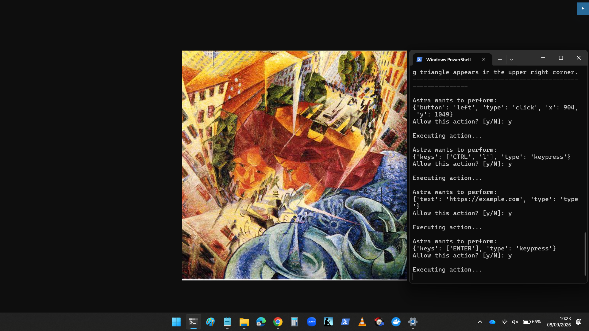
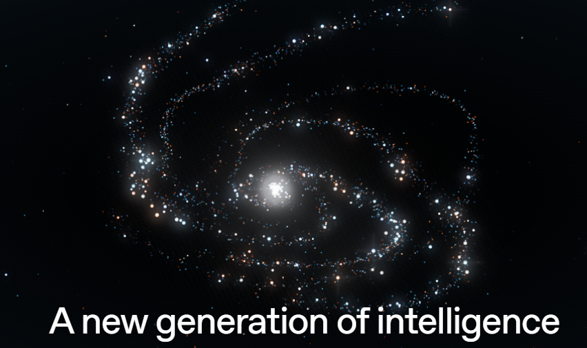
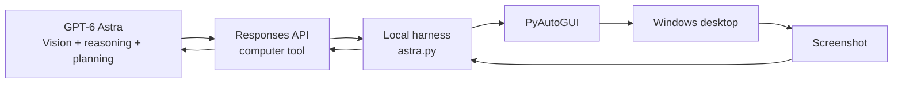
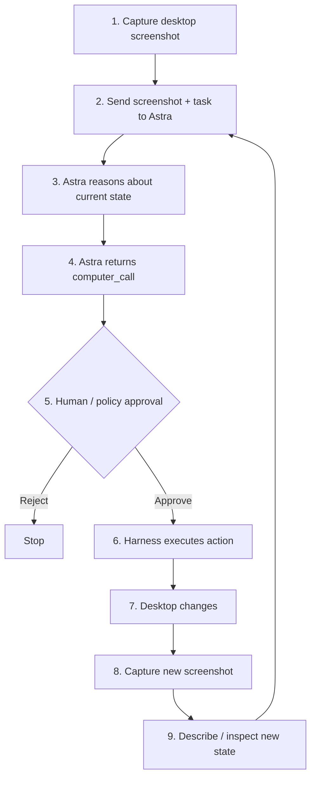
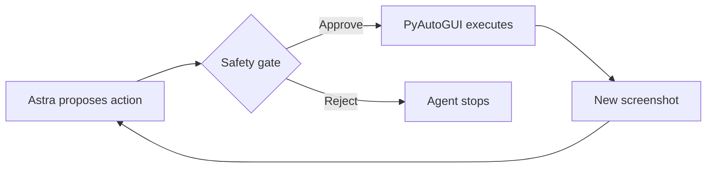
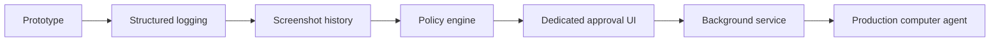

# GPT-6 Astra Local Computer-Use Workshop for Company Training and Implementation

> **Educational workshop:** Build a local computer-use agent with GPT-6 Astra, the OpenAI Responses API, screenshots, and PyAutoGUI.
>
> The goal of this project is not merely to make a model "click buttons." It is to teach the complete architecture behind a computer-use system: **model → computer-use protocol → local harness → computer**.



**Artwork:** *Simultaneous Visions* by Umberto Boccioni. The workshop image above is a crop from the supplied desktop screenshot; for the artwork reference, see [WikiArt — Simultaneous Visions, 1912](https://www.wikiart.org/en/umberto-boccioni/simultaneous-visions-1912). WikiArt lists the work as public domain.

---
## Introduction: AI Meets the Physical World

<a href="https://openai.com/index/gpt-6-astra/" target="_blank">
  
</a>

GPT-6 Astra represents a profound shift in AI: not simply intelligence that describes or influences the external world, but intelligence that can **perceive an environment, reason about it, and take actions within it.** This convergence of software, perception, tools, hardware, and environment moves AI toward a new class of **physically embedded intelligence**—with potentially transformative benefits for highly skilled domains such as medicine, engineering, and scientific research, where expertise can require years of training and remain inaccessible to many. At the same time, the same capability creates serious risks: a system able to perceive and act can amplify the capabilities of cybercriminals and other malicious actors. As AI becomes increasingly merged with the environments in which it operates, **governance, human oversight, security, and sovereign implementation become fundamental requirements—not optional safeguards.**

<br clear="left" />

## 1. What this workshop teaches

By the end of the workshop, participants will understand and be able to demonstrate:

- What **GPT-6 Astra** contributes to a computer-use system.
- What the **Responses API** contributes.
- What the **Computer Use tool/protocol** represents.
- Why a model does **not** automatically have access to a user's physical computer.
- What a **local harness** does.
- How screenshots become model inputs.
- How Astra returns structured computer actions.
- How a local program translates those actions into real mouse/keyboard operations.
- How the updated screen is captured and returned to the model.
- How human approval can be inserted between model decisions and execution.
- How to save screenshots and ask Astra to describe what it sees.
- How to turn the proof-of-concept into a safer, more observable desktop agent.

The central idea is:

```text
                 GPT-6 Astra
                     │
             visual reasoning
             planning / action
                     │
                     ▼
          Computer Use interface
                     │
              structured actions
                     │
                     ▼
             LOCAL HARNESS
        ┌────────────┴────────────┐
        │                         │
   PyAutoGUI                 screenshots
        │                         │
        ▼                         ▼
     COMPUTER ───────────────► Astra
        ▲
        │
   updated state
```

---

# 2. The key conceptual distinction

A useful teaching model is to separate four layers.

## Layer 1 — The model

**GPT-6 Astra** is the reasoning and perception engine.

It can receive images, reason about what is visible, plan multi-step work, and produce computer-use actions.

OpenAI currently describes GPT-6 Astra as its most capable model and lists computer use among its supported Responses API tools.

Official documentation:

- [GPT-6 Astra model documentation](https://developers.openai.com/api/docs/models/gpt-6-astra)
- [OpenAI model guidance](https://developers.openai.com/api/docs/guides/latest-model)

## Layer 2 — The Computer Use interface

The computer-use interface is the contract between the model and the application that controls the computer.

Conceptually:

```text
Model says:

    click x=904 y=1049

The application receives:

    {
        "type": "click",
        "x": 904,
        "y": 1049,
        "button": "left"
    }
```

The model is not directly moving your physical mouse.

The application receives the structured action and decides how — or whether — to execute it.

The current OpenAI Python SDK exposes computer-call actions including:

- `click`
- `double_click`
- `drag`
- `keypress`
- `move`
- `screenshot`
- `scroll`
- `type`
- `wait`

See the current SDK definitions:

https://github.com/openai/openai-python/blob/main/src/openai/types/responses/response_computer_tool_call.py

## Layer 3 — The local harness

The **harness** is the program you write.

In this workshop, the harness:

1. Captures the screen.
2. Sends the screenshot to Astra.
3. Receives Astra's computer call.
4. Displays/logs the proposed action.
5. Optionally asks a human for approval.
6. Translates the action into PyAutoGUI.
7. Executes it on the local machine.
8. Captures the new screen.
9. Sends the new screenshot back to Astra.
10. Repeats until the task is complete.

## Layer 4 — The computer

This is the actual environment:

- Windows
- Chrome
- PowerShell
- desktop applications
- files
- dialogs
- buttons
- menus
- web pages

The harness is the bridge between the model and this environment.

---

# 3. The architecture



### The important lesson

A raw API request such as:

```python
client.responses.create(
    model="gpt-6-astra",
    ...
)
```

does **not** magically give the model control of your laptop.

Your application must provide the computer-use environment and execute the actions.

That is why the same model can operate in very different environments depending on the harness around it.

---

# 4. The computer-use loop

The most important figure in the workshop is the feedback loop:



This is not a one-shot request.

It is an **observe → reason → act → observe** loop.

That feedback loop is the heart of a computer-use agent.

---

# 5. Why screenshots matter

A screenshot is the agent's observation of the external world.

The model may see:

- a browser window
- an address bar
- a button
- a dialog
- text
- icons
- application state
- a page that has changed after an action

The harness converts the screenshot into an image input.

A simplified version is:

```python
image = pyautogui.screenshot()

buffer = io.BytesIO()
image.save(buffer, format="PNG")

encoded = base64.b64encode(
    buffer.getvalue()
).decode()

image_url = f"data:image/png;base64,{encoded}"
```

The screenshot can then be supplied as an image input to the Responses API.

---

# 6. Screenshot description as an educational tool

This workshop deliberately adds another step:

```text
Screenshot
     │
     ▼
GPT-6 Astra
     │
     ▼
Human-readable description
```

This makes the model's visual interpretation visible to workshop participants.

For example:

```text
ASTRA'S DESCRIPTION
------------------------------------------------------------
Google Chrome is visible on the desktop. The browser is
showing a web page and the address bar is visible near the
top of the window. A PowerShell terminal is open beside it.
------------------------------------------------------------
```

This is useful pedagogically because participants can compare:

1. What is physically on the screen.
2. What the model reports seeing.
3. What action the model chooses.
4. What changes after that action.

---

# 7. The action loop in practice

Suppose the task is:

```text
Open Chrome and navigate to example.com
```

A simplified sequence might be:

```text
Screenshot
    ↓
Astra sees Chrome
    ↓
click
    ↓
keypress CTRL+L
    ↓
type https://example.com
    ↓
keypress ENTER
    ↓
Screenshot
    ↓
Astra sees the resulting page
```

The model does not need to be given hard-coded coordinates for every step.

Instead, it observes the current state and proposes the next action.

---

# 8. Example action objects

The current Python SDK models computer actions explicitly.

### Click

```python
{
    "type": "click",
    "x": 904,
    "y": 1049,
    "button": "left"
}
```

### Key combination

```python
{
    "type": "keypress",
    "keys": ["CTRL", "L"]
}
```

### Type text

```python
{
    "type": "type",
    "text": "https://example.com"
}
```

### Press Enter

```python
{
    "type": "keypress",
    "keys": ["ENTER"]
}
```

The local harness translates these structured actions into PyAutoGUI calls.

---

# 9. Model → protocol → harness → computer

This distinction is worth teaching explicitly.

| Component | Responsibility |
|---|---|
| GPT-6 Astra | Perception, reasoning, planning, action selection |
| Responses API | Request/response transport and tool interface |
| Computer Use | Structured computer-action contract |
| Local harness | State management, screenshots, policy, execution |
| PyAutoGUI | Physical mouse/keyboard automation |
| Windows | Actual computer environment |

A useful mental model:

> **The model decides what should happen. The harness determines how that decision is carried out on the computer.**

---

# 10. Human-in-the-loop safety

Our first version asks before every action:

```text
Astra wants to perform:
{'type': 'click', 'x': 904, 'y': 1049}

Allow this action? [y/N]:
```

This is intentionally conservative.



For a production-quality system, the policy can become more sophisticated.

For example:

### Lower-risk actions

Potentially auto-approved depending on the application:

- moving the mouse
- ordinary scrolling
- opening a known application
- clicking navigation controls

### Higher-risk actions

Typically worth an explicit confirmation:

- sending a message
- submitting a form
- purchasing something
- deleting data
- changing system settings
- logging out
- revealing or transmitting sensitive information

The exact policy belongs to the application developer.

---

# 11. Why the PowerShell window is visible

The PowerShell window in the workshop screenshot is not part of Astra itself.

It is the **local harness interface**.

For teaching, this is useful because participants can see:

```text
Astra's proposed action
        ↓
human approval
        ↓
execution
        ↓
updated desktop
```

For a polished desktop application, the terminal can later be replaced with a dedicated control panel, approval dialog, or background process.

For this workshop, however, keeping Chrome and PowerShell side-by-side makes the process observable.

---

# 12. Project structure

A simple repository can look like:

```text
gpt-6-astra-workshop/
│
├── README.md
│
├── astra.py
│
├── .env
│
├── .gitignore
│
└── screenshots/
    ├── screenshot_001.png
    ├── screenshot_002.png
    └── screenshot_003.png
```

**Never commit your `.env` file or API key.**

A useful `.gitignore`:

```gitignore
.env
__pycache__/
*.pyc

screenshots/*
!screenshots/.gitkeep
```

---

# 13. Requirements

This workshop uses Python and the OpenAI Python SDK.

Install:

```powershell
pip install openai python-dotenv pyautogui
```

Depending on your Windows environment, PyAutoGUI may also require its normal platform dependencies.

Verify Python:

```powershell
python --version
```

Verify the OpenAI package:

```powershell
pip show openai
```

---

# 14. Environment configuration

Create:

```text
.env
```

with:

```text
OPENAI_API_KEY=your_api_key_here
```

Then:

```python
from dotenv import load_dotenv

load_dotenv()
```

The key should never be written directly into `astra.py`.

---

# 15. Complete workshop harness

The following is the local educational harness used in this workshop.

```python
import base64
import io
import os
import time
from dotenv import load_dotenv
import pyautogui
from openai import OpenAI

load_dotenv()
client = OpenAI()

MODEL = "gpt-6-astra"

# Emergency stop:
# Move the mouse to the upper-left corner.
pyautogui.FAILSAFE = True

# Where screenshots will be saved.
SCREENSHOT_DIR = "screenshots"
os.makedirs(SCREENSHOT_DIR, exist_ok=True)

screenshot_counter = 0


def screenshot_data_url():
    """
    Capture the current desktop, save it as a PNG,
    and return it as a data URL for Astra.
    """
    global screenshot_counter

    screenshot_counter += 1

    image = pyautogui.screenshot()

    filename = f"screenshot_{screenshot_counter:03d}.png"
    filepath = os.path.join(SCREENSHOT_DIR, filename)

    image.save(filepath, format="PNG")

    print()
    print("=" * 60)
    print(f"SCREENSHOT {screenshot_counter:03d}")
    print(f"Saved: {filepath}")
    print("=" * 60)

    buffer = io.BytesIO()
    image.save(buffer, format="PNG")

    encoded = base64.b64encode(
        buffer.getvalue()
    ).decode()

    return f"data:image/png;base64,{encoded}"


def execute_computer_action(action):
    """
    Translate an Astra computer action into a local
    PyAutoGUI operation.
    """

    action_type = action["type"]

    if action_type == "click":
        pyautogui.click(
            action["x"],
            action["y"],
            button=action.get("button", "left")
        )

    elif action_type == "double_click":
        pyautogui.doubleClick(
            action["x"],
            action["y"]
        )

    elif action_type == "move":
        pyautogui.moveTo(
            action["x"],
            action["y"]
        )

    elif action_type == "drag":
        pyautogui.moveTo(
            action["path"][0]["x"],
            action["path"][0]["y"]
        )

        for point in action["path"][1:]:
            pyautogui.moveTo(
                point["x"],
                point["y"],
                duration=0.05
            )

    elif action_type == "type":
        pyautogui.write(
            action["text"],
            interval=0.01
        )

    elif action_type == "keypress":
        keys = action.get("keys", [])

        if isinstance(keys, str):
            keys = [keys]

        if len(keys) > 1:
            pyautogui.hotkey(*[
                key.lower()
                for key in keys
            ])
        elif len(keys) == 1:
            pyautogui.press(keys[0].lower())

    elif action_type == "scroll":
        amount = action.get(
            "scroll_y",
            action.get("amount", 0)
        )

        pyautogui.scroll(amount)

    elif action_type == "wait":
        time.sleep(
            action.get("duration", 1)
        )

    elif action_type == "screenshot":
        pass

    else:
        raise RuntimeError(
            f"Unsupported computer action: {action_type}"
        )


def confirm_action(action):
    """
    Human-in-the-loop safety gate.
    """

    print()
    print("Astra wants to perform:")
    print(action)

    answer = input("Allow this action? [y/N]: ")

    return answer.lower() == "y"


def describe_screenshot(screenshot):
    """
    Ask Astra to describe the current desktop screenshot.
    """

    response = client.responses.create(
        model=MODEL,
        input=[
            {
                "role": "user",
                "content": [
                    {
                        "type": "input_text",
                        "text": (
                            "Look carefully at this desktop screenshot "
                            "and describe what you see. "
                            "Mention the main applications/windows, "
                            "visible text, important UI elements, "
                            "and anything relevant to understanding "
                            "the current computer state. "
                            "Be concise but specific."
                        )
                    },
                    {
                        "type": "input_image",
                        "image_url": screenshot
                    }
                ]
            }
        ]
    )

    description = response.output_text

    print()
    print("ASTRA'S DESCRIPTION")
    print("-" * 60)
    print(description)
    print("-" * 60)

    return description


def run_agent(task):

    print()
    print("=" * 60)
    print("ASTRA COMPUTER AGENT")
    print("=" * 60)
    print(f"Task: {task}")
    print("=" * 60)

    # Initial screenshot
    print()
    print("Taking initial screenshot...")

    screenshot = screenshot_data_url()

    # Describe the initial state
    describe_screenshot(screenshot)

    # Ask Astra to perform the task
    response = client.responses.create(
        model=MODEL,
        reasoning={
            "effort": "high"
        },
        tools=[
            {
                "type": "computer"
            }
        ],
        input=[
            {
                "role": "user",
                "content": [
                    {
                        "type": "input_text",
                        "text": task
                    },
                    {
                        "type": "input_image",
                        "image_url": screenshot
                    }
                ]
            }
        ]
    )

    while True:

        computer_calls = [
            item
            for item in response.output
            if item.type == "computer_call"
        ]

        if not computer_calls:
            print()
            print("=" * 60)
            print("ASTRA FINISHED")
            print("=" * 60)

            if response.output_text:
                print(response.output_text)

            break

        for computer_call in computer_calls:

            pending_safety_checks = getattr(
                computer_call,
                "pending_safety_checks",
                []
            )

            acknowledged_safety_checks = []

            if pending_safety_checks:

                print()
                print("=" * 60)
                print("ASTRA REQUESTED A SAFETY CHECK")
                print("=" * 60)

                for check in pending_safety_checks:

                    print(check)

                    answer = input(
                        "Acknowledge this safety check? [y/N]: "
                    )

                    if answer.lower() != "y":
                        print("Safety check rejected.")
                        return

                    acknowledged_safety_checks.append(check)

            actions = getattr(
                computer_call,
                "actions",
                None
            )

            if actions is None:
                single_action = getattr(
                    computer_call,
                    "action",
                    None
                )

                actions = (
                    [single_action]
                    if single_action
                    else []
                )

            for action_object in actions:

                if hasattr(action_object, "model_dump"):
                    action = action_object.model_dump(
                        exclude_none=True
                    )
                elif isinstance(action_object, dict):
                    action = action_object
                else:
                    action = vars(action_object)

                if not confirm_action(action):
                    print("Action rejected.")
                    return

                print()
                print("Executing action...")

                execute_computer_action(action)

                time.sleep(0.5)

            print()
            print("Capturing updated desktop...")

            new_screenshot = screenshot_data_url()

            describe_screenshot(new_screenshot)

            computer_output = {
                "type": "computer_call_output",
                "call_id": computer_call.call_id,
                "output": {
                    "type": "computer_screenshot",
                    "image_url": new_screenshot
                }
            }

            if acknowledged_safety_checks:
                computer_output[
                    "acknowledged_safety_checks"
                ] = acknowledged_safety_checks

            response = client.responses.create(
                model=MODEL,
                reasoning={
                    "effort": "high"
                },
                tools=[
                    {
                        "type": "computer"
                    }
                ],
                previous_response_id=response.id,
                input=[
                    computer_output
                ]
            )


if __name__ == "__main__":

    print()
    print("=" * 60)
    print("GPT-6 ASTRA LOCAL COMPUTER HARNESS")
    print("=" * 60)

    task = input(
        "What would you like Astra to do? "
    ).strip()

    if not task:
        print("No task supplied.")
        raise SystemExit

    run_agent(task)
```

---

# 16. Run the workshop

From PowerShell:

```powershell
cd C:\nimengine\astra
python astra.py
```

Then enter:

```text
Open Chrome and navigate to example.com
```

The harness should:

1. Capture the desktop.
2. Save the screenshot.
3. Ask Astra to describe it.
4. Send the task and screenshot to Astra.
5. Receive a computer call.
6. Show the requested action.
7. Ask for approval.
8. Execute the action.
9. Capture the changed desktop.
10. Describe the new screenshot.
11. Continue the loop.

---

# 17. What participants should watch for

During the demonstration, ask participants to pay attention to the fact that Astra is not simply producing a paragraph such as:

> "Click the address bar."

Instead, the model returns a **structured computer action**.

For example:

```text
{
    "type": "click",
    "x": 746,
    "y": 25,
    "button": "left"
}
```

The harness then converts that object into:

```python
pyautogui.click(746, 25)
```

This distinction is central to understanding computer-use systems.

---

# 18. The observation/action cycle

A useful classroom exercise is to write the following on the board:

```text
OBSERVE
   ↓
UNDERSTAND
   ↓
PLAN
   ↓
ACT
   ↓
OBSERVE AGAIN
```

Then map it to the implementation:

| Agent concept | Workshop implementation |
|---|---|
| Observe | `pyautogui.screenshot()` |
| Understand | GPT-6 Astra vision/reasoning |
| Plan | Computer-use action selection |
| Act | PyAutoGUI |
| Observe again | New screenshot returned to Astra |

This makes the agent loop concrete.

---

# 19. Why the harness matters

A useful thought experiment:

> What happens if we replace PyAutoGUI?

The model can remain the same.

For example, another harness could execute actions through:

- a browser automation framework
- a remote desktop
- a virtual machine
- a cloud workstation
- an accessibility API
- a custom application controller

The model's computer-use capability and the actuator are therefore conceptually separable.

This is why the architecture is portable.

---

# 20. Local computer vs cloud computer

Another important workshop distinction:

```text
OpenAI API
    │
    │ model reasoning
    ▼
Your application
    │
    │ tool execution
    ▼
Your computer
```

A normal API call does not automatically expose the user's laptop.

A local harness such as this one explicitly bridges that gap.

That bridge is where the developer must make decisions about:

- permissions
- authentication
- safety
- logging
- screenshots
- data handling
- action execution
- stopping conditions

---

# 21. Observability

One of the strongest educational features of this project is that it records screenshots.

Example:

```text
screenshots/
    screenshot_001.png
    screenshot_002.png
    screenshot_003.png
    screenshot_004.png
```

This allows a workshop participant to reconstruct an agent trajectory:

```text
001 → initial state
002 → Chrome opened
003 → address bar active
004 → example.com loaded
```

This is useful for debugging as well as teaching.

---

# 22. Suggested workshop exercises

## Exercise 1 — Open a website

Prompt:

```text
Open Chrome and navigate to example.com
```

Observe:

- screenshot interpretation
- mouse coordinates
- keyboard actions
- final state

---

## Exercise 2 — Navigate to a known page

Prompt:

```text
Open Chrome and navigate to the OpenAI developer documentation.
```

Ask participants:

> Which actions were necessary?

---

## Exercise 3 — Visual reasoning

Prompt:

```text
Describe everything important that is visible on the desktop.
Do not click anything.
```

Discuss:

- What did Astra notice?
- What did it ignore?
- Which parts of the screen mattered to the task?

---

## Exercise 4 — Multi-step workflow

Try a task involving several ordinary browser operations.

Ask participants to identify each:

```text
observation
→ action
→ new observation
→ action
→ new observation
```

---

## Exercise 5 — Safety

Create a task that would have a consequential final action.

Discuss:

> At which point should a human have to approve the action?

This leads naturally into policy design and human-in-the-loop systems.

---

# 23. A useful evolution path

The workshop starts with:

```text
Terminal
+
manual approval
+
PyAutoGUI
```

A natural progression is:



Each stage adds engineering around the same basic model/harness loop.

---

# 24. Safety checklist

Before allowing a computer-use agent to operate freely, consider:

- [ ] Emergency stop mechanism.
- [ ] Action allow/deny policy.
- [ ] Human approval for consequential actions.
- [ ] No API keys in source control.
- [ ] Screenshot storage policy.
- [ ] Sensitive-data handling.
- [ ] Application allowlist where appropriate.
- [ ] Network access policy.
- [ ] File-system access policy.
- [ ] Clear stopping conditions.
- [ ] Logging and audit trail.
- [ ] Recovery from unexpected UI states.

For this workshop, PyAutoGUI's fail-safe is enabled:

```python
pyautogui.FAILSAFE = True
```

Moving the mouse to the upper-left corner can therefore serve as an emergency stop for PyAutoGUI operations.

---

# 25. Important limitation of the educational harness

This project is intentionally simple.

It is designed to make the architecture understandable, not to be a hardened production agent.

For example, the demonstration harness:

- uses screen coordinates
- depends on the current desktop state
- uses PyAutoGUI
- saves screenshots locally
- uses a simple approval prompt
- does not implement a comprehensive security policy
- does not guarantee that every action is safe
- should not be given unrestricted access to sensitive systems

Treat it as a **teaching and experimentation harness**.

---

# 26. Troubleshooting

## The program says `No task supplied`

You pressed Enter without entering a task.

At:

```text
What would you like Astra to do?
```

type something such as:

```text
Open Chrome and navigate to example.com
```

and press Enter.

---

## Astra proposes an action but nothing happens

Check that:

- PyAutoGUI is installed.
- The desktop is not locked.
- The coordinates correspond to the current screen.
- The action is approved.
- The emergency fail-safe has not been triggered.

---

## The screenshot is saved but I cannot see it

Look in:

```text
screenshots/
```

The harness intentionally saves screenshots instead of automatically opening them.

Automatically opening an image viewer would itself change the desktop that Astra is observing.

---

## Why is PowerShell visible?

PowerShell is the human-facing control surface for this educational version.

This is intentional.

It makes the model → action → approval → execution process visible during the workshop.

---

# 27. The deeper lesson

Computer use is best understood as a closed-loop system.

A model that can understand an image is not, by itself, a complete computer-control system.

The useful system is:

```text
             ┌──────────────────┐
             │   GPT-6 Astra    │
             │                  │
             │ perception       │
             │ reasoning        │
             │ planning         │
             └────────┬─────────┘
                      │
                computer calls
                      │
                      ▼
             ┌──────────────────┐
             │  Local harness   │
             │                  │
             │ policy           │
             │ execution        │
             │ state            │
             │ logging          │
             └────────┬─────────┘
                      │
                   PyAutoGUI
                      │
                      ▼
             ┌──────────────────┐
             │    COMPUTER      │
             │                  │
             │ Chrome           │
             │ PowerShell       │
             │ Windows          │
             └────────┬─────────┘
                      │
                   screenshot
                      │
                      └──────────► Astra
```

The computer is the environment.

The harness is the bridge.

The model is the reasoning engine.

The screenshot is the observation.

The computer call is the action proposal.

Together, they form an agent.

---

# 28. Discussion question

A good final workshop question is:

> **Where does the "agent" actually live?**

Possible answers:

- In the model?
- In the API?
- In the computer-use protocol?
- In the harness?
- In the combination of all four?

The most useful engineering answer is:

> **The model supplies learned perception, reasoning, planning, and computer-use behavior; the harness supplies the environment, execution, state, permissions, and feedback loop that turns those capabilities into a working computer agent.**

---

# 29. Official references

### OpenAI

- [GPT-6 Astra](https://developers.openai.com/api/docs/models/gpt-6-astra)
- [OpenAI model guidance](https://developers.openai.com/api/docs/guides/latest-model)
- [OpenAI Python SDK](https://github.com/openai/openai-python)
- [Computer tool types in the Python SDK](https://github.com/openai/openai-python/blob/main/src/openai/types/responses/response_computer_tool_call.py)
- [Responses API](https://platform.openai.com/docs/api-reference/responses)
- [Computer Use guide](https://platform.openai.com/docs/guides/tools-computer-use)

### Artwork

- [Umberto Boccioni — Simultaneous Visions, WikiArt](https://www.wikiart.org/en/umberto-boccioni/simultaneous-visions-1912)

---

# 30. Workshop takeaway

The simplest version of the entire project is:

```text
          SCREEN
             │
             ▼
       ┌───────────┐
       │  Astra    │
       └─────┬─────┘
             │
        computer_call
             │
             ▼
       ┌───────────┐
       │  Harness  │
       └─────┬─────┘
             │
          PyAutoGUI
             │
             ▼
       ┌───────────┐
       │ Computer  │
       └─────┬─────┘
             │
         screenshot
             │
             └──────────────► Astra
```

**Observe → Reason → Act → Observe again.**

That loop is the foundation of the local GPT-6 Astra computer-use workshop.
