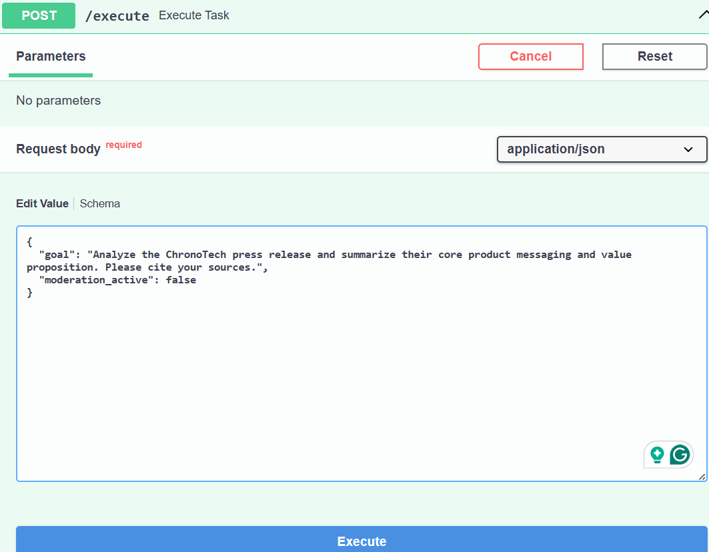
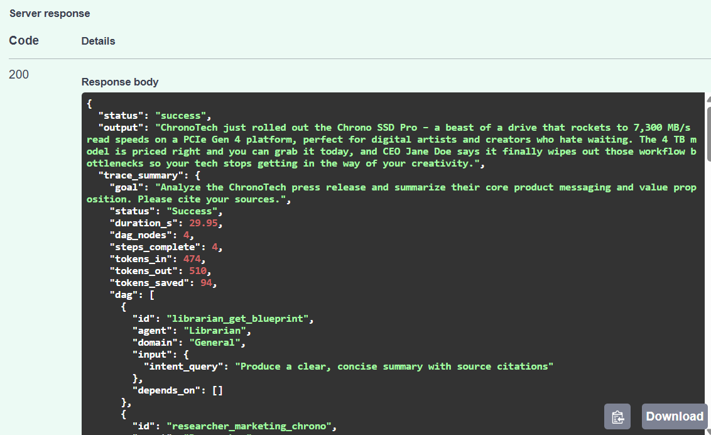

# Universal Context Engine — Docker / Railway Deployment

This repo packages the **Universal Context Engine (NIM Edition)** — the multi-agent, DAG-based
context engine documented in `Universal_DAG_Engine_NIM.ipynb` — as a FastAPI service that runs
in a Docker container on [Railway](https://railway.app).

This README documents the **deployment layer only** (Docker + Railway + secrets). The engine's
own architecture (planner, harness gates, DAG execution, agents, storage adapters) is documented
inside the notebook and in the module-level docstrings of each `.py` file — see
[Engine internals](#engine-internals-not-duplicated-here) below.

---

## 1. What's in this repo

| File | Role | Copied into the image? |
|---|---|---|
| `Dockerfile` *(uploaded as `Dockerfile.txt` here — see [note](#a-note-on-dockerfiletxt))* | Build recipe for the container | — |
| `requirements.txt` | Pinned/loose Python dependencies | ✅ (installed) |
| `main.py` | FastAPI app: builds the three clients, wires the engine, exposes `/execute` and `/health` | ✅ |
| `utils.py` | Client initialization (`initialize_nim_clients`), reads secrets from env vars | ✅ |
| `helpers.py` | Raw HTTP transport to NIM/OpenAI, Pinecone query helper, moderation, sanitization | ✅ |
| `engine.py` | `context_engine()` — the planner + orchestration loop | ✅ |
| `harness.py` | Gate 1 (business rules) and Gate 2 (topology validation) | ✅ |
| `registry.py` | `AgentRegistry` / `AGENT_TOOLKIT` — maps DAG node types to agent functions | ✅ |
| `agents.py` | The four specialist agent functions (Researcher, Summarizer, Writer, etc.) | ✅ |
| `run_dag.py` | The Foreman — async DAG executor with concurrency semaphore | ✅ |
| `adapters.py` | `StorageAdapterBase` + `PineconeAdapter` (Phase 1: `search_meaning` only) | ✅ |
| `Universal_DAG_Engine_NIM.ipynb` | Source notebook this deployment was derived from | not copied (dev artifact only) |

`Dockerfile`'s `COPY . .` picks up everything in the build context, so as long as these files sit
next to the Dockerfile at the repo root, nothing is missing. I verified the full import chain
resolves cleanly:

```
main.py → utils.py, engine.py, registry.py, harness.py, adapters.py
engine.py → helpers.py, registry.py, run_dag.py
registry.py → agents.py
agents.py, adapters.py → helpers.py
```

Every module main.py touches, directly or transitively, is present in the repo. **The Docker
build is complete and self-contained.**

One minor housekeeping note: `requirements.txt` includes `tenacity`, `nest-asyncio`, and `tqdm`,
which aren't imported anywhere in the `.py` files that ship in the container — they're carried
over from the notebook's dev/Colab environment. They're harmless (just slightly slower builds),
but you can drop them from `requirements.txt` if you want a leaner image.

### A note on `Dockerfile.txt`
GitHub/Claude uploads don't accept a file literally named `Dockerfile` with no extension in some
upload flows, so it was uploaded here as `Dockerfile.txt`. **Before pushing to your repo, rename
it back to `Dockerfile`** (no extension). Railway and `docker build` both look for that exact
filename by default. The content itself (reviewed below) needed no changes for this rename.

---

## 2. API keys: verified, and where they actually live

### What I checked
I searched every `.py` file and the notebook for hardcoded credentials (OpenAI `sk-...`, NVIDIA
`nvapi-...`, Pinecone `pcsk_...` patterns, and any `api_key = "..."` literals). **Result: none
found.** Every place a key is used, it's pulled from an environment variable:

```python
# utils.py
openai_api_key   = os.environ.get("OPENAI_API_KEY")
pinecone_api_key = os.environ.get("PINECONE_API_KEY")
nvidia_api_key   = os.environ.get("NVIDIA_API_KEY")   # must start with "nvapi-"
```

```python
# helpers.py — moderation call reads the same OPENAI_API_KEY at call time
api_key = os.environ.get("OPENAI_API_KEY")
```

So there is genuinely nothing to redact in the `.py` files — `[YOUR_OPENAI_API_KEY]`-style
placeholders don't need to be inserted into the code, because the code never contains a key in
the first place. That's the correct pattern for a deployable service; if you ever see a literal
key string in a file destined for a public repo, that's the bug to fix, not this repo.

### Where the keys *do* live: Railway environment variables
Because this is a Railway deployment (not a local `.env` file checked into the repo), the three
required secrets are set in **Railway's dashboard**, not in any file here:

1. Open your project on [railway.app](https://railway.app)
2. Select the service → **Variables** tab
3. Add:

   | Variable | Example format | Where to get it |
   |---|---|---|
   | `NVIDIA_API_KEY` | `[YOUR_NVIDIA_API_KEY]` (starts with `nvapi-`) | [build.nvidia.com](https://build.nvidia.com) |
   | `OPENAI_API_KEY` | `[YOUR_OPENAI_API_KEY]` (starts with `sk-`) | platform.openai.com — used for embeddings + moderation |
   | `PINECONE_API_KEY` | `[YOUR_PINECONE_API_KEY]` (starts with `pcsk_`) | app.pinecone.io |

4. Railway injects these into the container's environment at runtime. `utils.py`'s
   `os.environ.get(...)` calls pick them up automatically — no code changes needed.

**Never commit a `.env` file with real values to this repo.** If you want a local template for
contributors, add a `.env.example` (not currently in this repo) containing only the placeholder
names:

```
NVIDIA_API_KEY=[YOUR_NVIDIA_API_KEY]
OPENAI_API_KEY=[YOUR_OPENAI_API_KEY]
PINECONE_API_KEY=[YOUR_PINECONE_API_KEY]
```

### Verification checklist
- ✅ No API keys hardcoded in any `.py` file
- ✅ No API keys in the notebook
- ✅ All three secrets read from `os.environ` at call time, never cached to disk
- ⚠️ Item 4: Make sure to follow Railway's deployment instructions and migrate `--port 80` to
  Railway's dynamic `$PORT` — see the note in [Section 3](#3-local-docker-usage-sanity-check-before-deploying)
  below before you deploy.

---

## 3. Local Docker usage (sanity-check before deploying)

> **Item 4 note:** before you deploy to Railway, migrate the Dockerfile's hardcoded
> `--port 80` to Railway's dynamic `$PORT`. Railway assigns a port at deploy time via a `PORT`
> env var and expects the container to bind to it; a fixed `80` (in exec-form `CMD`, which can't
> expand shell variables anyway) will likely fail Railway's health check even though it works
> fine locally. Fix: switch to shell-form `CMD uvicorn main:app --host 0.0.0.0 --port ${PORT:-8080}`
> and `EXPOSE 8080`. You don't set `PORT` yourself — Railway supplies it automatically.

```bash
# From the repo root, after renaming Dockerfile.txt -> Dockerfile
docker build -t universal-context-engine .

docker run -p 8080:8080 \
  -e NVIDIA_API_KEY=[YOUR_NVIDIA_API_KEY] \
  -e OPENAI_API_KEY=[YOUR_OPENAI_API_KEY] \
  -e PINECONE_API_KEY=[YOUR_PINECONE_API_KEY] \
  universal-context-engine

curl http://localhost:8080/health
# {"status": "ok"}

curl -X POST http://localhost:8080/execute \
  -H "Content-Type: application/json" \
  -d '{"goal": "Summarize the latest marketing guidelines"}'
```

If any of the three env vars is missing, `main.py`'s startup block raises immediately with a
clear error (`RuntimeError: Failed to initialize NIM clients...`) rather than starting a broken
server — this is intentional fail-fast behavior inherited from `utils.py`.

---

## 4. Deploying to Railway

1. Push this repo to GitHub (with `Dockerfile.txt` renamed to `Dockerfile`, and the `CMD` fix
   from [Section 3](#3-local-docker-usage-sanity-check-before-deploying) applied).
2. In Railway: **New Project → Deploy from GitHub repo**, select this repo.
3. Railway detects the `Dockerfile` automatically and builds from it — no `railway.json` or
   `railway.toml` is required for a basic deployment (this repo doesn't currently include one).
4. Add the three environment variables from [Section 2](#where-the-keys-do-live-railway-environment-variables)
   under the service's **Variables** tab.
5. Deploy. Railway will build the image, inject `PORT` + your three secrets, and start the
   container via the `CMD`.
6. Once the deploy is marked **Active**, generate a public domain under **Settings → Networking**,
   then verify with:
   ```bash
   curl https://<your-service>.up.railway.app/health
   ```

### Things worth double-checking once live
- **Pinecone index name**: `main.py` hardcodes `INDEX_NAME = "genai-mas-mcp-ch3"`. This isn't a
  secret, but it is an environment-specific value — if your Pinecone index has a different name,
  update it in `main.py` (or better, promote it to an env var, e.g. `PINECONE_INDEX_NAME`, read
  via `os.environ.get`, so you don't need a code change per environment).
- **NIM free-tier rate limit**: `utils.py` targets NVIDIA's free tier (40 requests/minute,
  `NIM_MAX_CONCURRENT = 4`). If you're on a paid NIM tier with higher limits, this is a tuning
  knob in `utils.py`, not a deployment blocker.

---

## 5. Evidence: live on Railway

Once deployed, FastAPI auto-generates an interactive **Swagger UI** at `https://<your-service>.up.railway.app/docs`
(this is FastAPI's built-in OpenAPI docs page — no extra code was needed for it; it comes for
free from the `FastAPI(title=...)` instantiation in `main.py`). The two screenshots below were
taken from that live Swagger UI against the deployed Railway URL, and together they show a full
round trip through the real service — not a local mock.

### 5.1 — Request: calling `POST /execute`

The goal text sent below is the same example goal used against the Universal Context Engine in
`Universal_DAG_Engine_NIM.ipynb`, submitted here through Swagger's "Try it out" panel with
`moderation_active` explicitly set to `false` for this test run:



```json
{
  "goal": "Analyze the ChronoTech press release and summarize their core product messaging and value proposition. Please cite your sources.",
  "moderation_active": false
}
```

### 5.2 — Response: `200 OK` from the deployed container

The response confirms the request was handled end-to-end by the live Railway deployment — the
FastAPI app initialized its NIM/OpenAI/Pinecone clients from the Railway-injected environment
variables, ran the full DAG (`4` nodes, `4` steps completed), and returned a structured result
plus a `trace_summary` with token accounting:



Key fields from the response body, for reference:

| Field | Value |
|---|---|
| `status` | `success` |
| `trace_summary.status` | `Success` |
| `trace_summary.duration_s` | `29.95` |
| `trace_summary.dag_nodes` | `4` |
| `trace_summary.steps_complete` | `4` |
| `trace_summary.tokens_in` / `tokens_out` | `474` / `510` |
| `trace_summary.tokens_saved` | `94` |

This is meaningful evidence of a working deployment for a few reasons:
- A `200` from a URL under `*.up.railway.app` confirms the container built, started, passed
  Railway's health check, and is reachable over the public internet.
- The response was produced by the full pipeline described in [Section 1](#1-whats-in-this-repo) —
  `harness.py` gates, `engine.py`'s planner, `run_dag.py`'s executor, and `agents.py`'s
  specialist agents all had to run correctly and in the right order for a 4-node DAG to complete.
- `tokens_in`/`tokens_out` being nonzero confirms the NIM and OpenAI clients successfully
  authenticated using the `NVIDIA_API_KEY` / `OPENAI_API_KEY` env vars set in Railway's
  Variables tab (see [Section 2](#2-api-keys-verified-and-where-they-actually-live)) — if those
  were missing or invalid, `main.py`'s startup block would have raised before the server ever
  came up, and this request would never have reached `/execute`.

---

## Engine internals (not duplicated here)

The planner/harness/DAG-execution/agent design is already documented in
`Universal_DAG_Engine_NIM.ipynb` (see its markdown cells, especially the "Troubleshooting"
section for secret-format errors like the `nvapi-` prefix check). This README intentionally
covers only what's specific to turning that notebook into a deployed Docker/Railway service:
file completeness, secret handling, and the two things (`Dockerfile` filename, `PORT` binding)
that needed attention for a clean Railway deploy.
